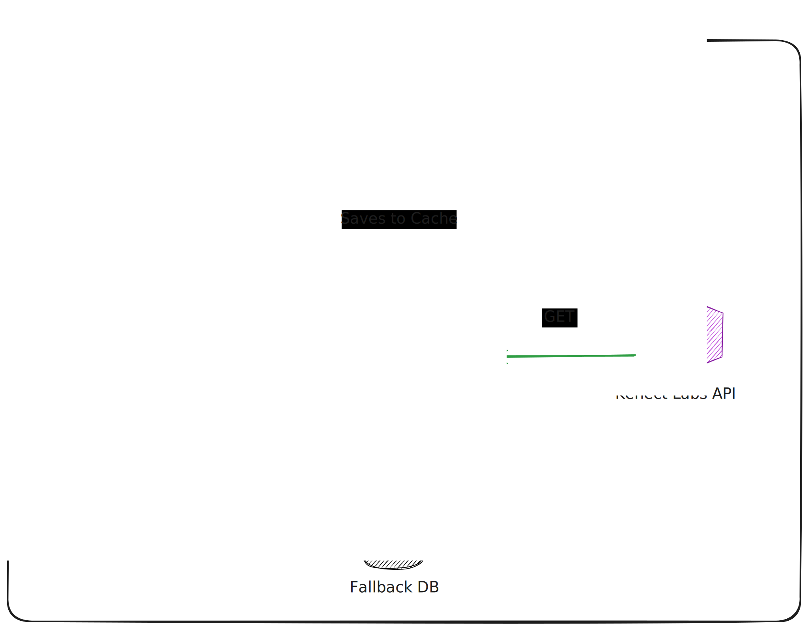
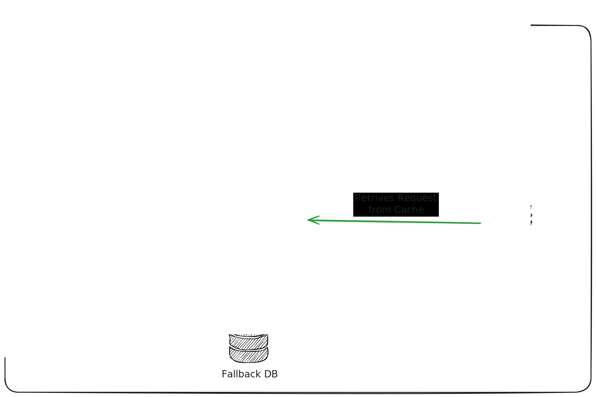
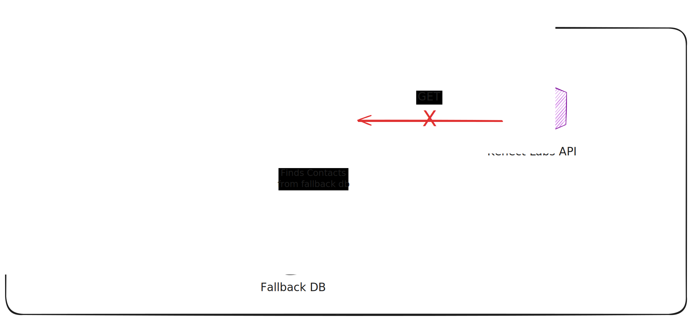
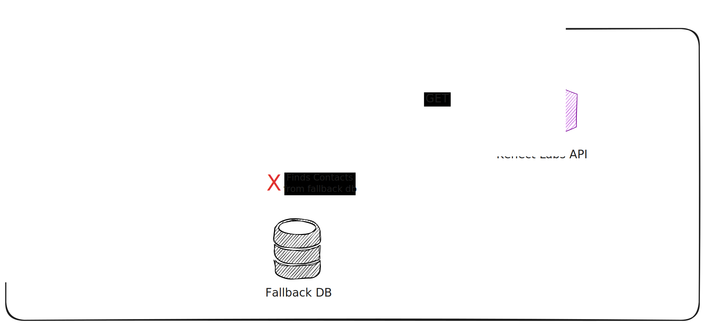
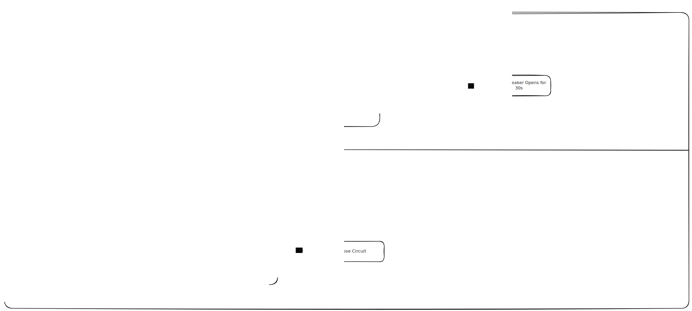

# 📚 Contacts Agenda API - Kenect Labs Take-Home

## 📋 Summary
- [Architecture Overview](#-architecture-overview)
- [Key Features & Design Decisions](#-key-features--design-decisions)
- [Getting Started](#-getting-started)
- [API Documentation](#-api-documentation)
- [Performance & Resilience](#-performance--resilience)
- [Production Considerations](#-production-considerations)

## 🏗️ Architecture Overview

[Editable Version - Click Here](https://excalidraw.com/#json=-p7CRGFiKFCR60wwiyfn1,w7lrRXbS0oG5wLb4MSF6cA)

This application implements a **multi-layered resilience strategy** that ensures high availability and optimal performance,
take a look into some diagrams that illustrate the main flows:

#### Happy Path - External API Success


#### Happy Path - Cache Hit


#### Unhappy Path - Fallback Working


#### Complete Unhappy Path - All Systems Down


#### Circuit Breaker Behavior


### Data Source Priority
1. **🏎️ Redis Cache** - Sub-millisecond response (if available and not expired)
2. **🌐 External API** - With retry and circuit breaker protection (primary source)
3. **💾 MongoDB Fallback** - When circuit breaker is open (ensures availability)

## 🎯 Key Features & Design Decisions

### 🧠 Intelligent Pagination Strategy

**Problem**: External APIs often have unpredictable dataset sizes. Making too many requests causes rate limiting; making too few requests is inefficient.

**Solution**: Smart 2-request optimization strategy:

```java
// First request: Get up to 1000 contacts (configurable default-page-size)
ContactPageResponse firstPage = contactClient.getContacts(1L, defaultPageSize);

// If total ≤ 1000: Return immediately (1 API call - optimized case)
// If total > 1000: Make second request for remaining contacts (2 API calls total)
```

**Benefits**:
- ✅ **500 contacts** → 1 API call (fetches all immediately)
- ✅ **1000 contacts** → 1 API call (fetches all immediately) 
- ✅ **5000 contacts** → 2 API calls (1st: 1000, 2nd: remaining 4000)
- ✅ Prevents API overload while minimizing network calls
- ✅ Configurable via `kenect.api.default-page-size` and we can even change it without redeploy through **Spring Boot Admin**

### 🛡️ Multi-Layer Resilience

#### Circuit Breaker Pattern
```yaml
resilience4j:
  circuitbreaker:
    instances:
      kenectApi:
        failure-rate-threshold: 50        # Opens after 50% failures
        sliding-window-size: 10           # In last 10 calls
        wait-duration-in-open-state: 30s  # Stay open for 30 seconds
        permitted-number-of-calls-in-half-open-state: 3
```

**States**:
- **🟢 CLOSED**: Normal operation - all calls pass through
- **🔴 OPEN**: After 5/10 calls fail → All calls go to fallback for 30s
- **🟡 HALF-OPEN**: After 30s → Allows 3 test calls
- **🟢 CLOSES**: If all 3 test calls succeed

#### Retry Strategy
```yaml
resilience4j:
  retry:
    instances:
      kenectApi:
        max-attempts: 3                    # 3 total attempts
        wait-duration: 1s                  # Base wait time
        enable-exponential-backoff: true   # 1s, 2s, 4s
        exponential-backoff-multiplier: 2
        randomized-wait-factor: 0.5        # ±50% jitter (prevents thundering herd)
```

#### Caching Strategy
```yaml
redis-cache:
  caches:
    - name: contactPages
      ttl: 5m                     # 5-minute cache TTL
      cache-null-values: false    # Don't cache null responses
```

**Cache Key Format**: `"page-pageSize"` (e.g., `"1-1000"`)

## 🚀 Getting Started

### Prerequisites
- Java 21
- Docker & Docker Compose

### 1. Start Infrastructure
```bash
# Start Redis, MongoDB, and LocalStack (for AWS Secrets Manager simulation)
docker-compose up -d

# Verify services are healthy
docker-compose ps
```

### 2. Set Environment Variables
```bash
# Required: Kenect Labs API token
export KENECT_API_TOKEN="put-your-token-here"

# Optional: Override defaults
export KENECT_API_HOST="https://candidate-challenge-api-489237493095.us-central1.run.app"
export KENECT_API_DEFAULT_PAGE_SIZE="1000"
export REDIS_HOST="localhost"
export REDIS_PORT="6379"
export MONGODB_URI="mongodb://localhost:27017/contacts_agenda"
```

### 3. Run the Application
```bash
# Using Gradle wrapper
./gradlew bootRun

# Or build and run JAR
./gradlew build
java -jar build/libs/contacts-agenda-0.0.1-SNAPSHOT.jar
```

### 4. Verify Setup
```bash
# Health check
curl http://localhost:8080/actuator/health

# Get contacts
curl http://localhost:8080/contacts

# API Documentation
open http://localhost:8080/swagger-ui.html
```

## 📚 API Documentation

### GET /contacts
Retrieves all contacts with automatic high availability and performance optimization.

**Response Example**:
```json
[
  {
    "id": 1,
    "name": "Mrs. Willian Bradtke",
    "email": "jerold@example.net",
    "source": "KENECT_LABS",
    "createdAt": "2020-06-24T19:37:16.688Z",
    "updatedAt": "2020-06-24T19:37:16.688Z"
  }
]
```

**Response Codes**:
- `200 OK` - Successfully retrieved contacts (from API or fallback)
- `503 Service Unavailable` - Both external API and fallback database unavailable
- `500 Internal Server Error` - Unexpected error occurred

**Interactive Documentation**: http://localhost:8080/swagger-ui.html

## Run Tests
```bash
# All tests
./gradlew test

# Integration tests only
./gradlew test --tests "*IntegrationTest"

# Unit tests only
./gradlew test --tests "*Test" --exclude-tasks "*IntegrationTest"

# Test report
open build/reports/tests/test/index.html
```

## ⚡ Performance & Resilience

### Performance Optimizations
1. **Redis Caching**: 5-minute TTL reduces API calls by ~95%
2. **Smart Pagination**: Minimizes network requests (max 2 API calls)

### Resilience Features
1. **Retry Logic**: 3 attempts with exponential backoff + jitter
2. **Circuit Breaker**: Automatic fallback after 50% failure rate
3. **Database Fallback**: Always-available cached dataset
4. **Graceful Degradation**: Service continues during partial outages

## 🚨 Production Considerations

### Documented Warnings & Future Enhancements

I've placed some comments along the code and some of them are talking about 
potential improvements or warnings for production readiness, inside comments
you're going to find something like this:

To enjoy the javadocs commenting reading I strongly recommend you to open it in Intellij.
```java
/**
 * <strong>⚠️ Production Consideration:</strong>
 * <blockquote>
 * Pagination should be implemented to prevent potential DoS attacks and performance issues
 * with large datasets. Currently returns all contacts since it's a requirement.
 * </blockquote>
 */

```
### Security Considerations
- In a real daily work, I would consider using AWS Secrets Manager or HashiCorp Vault for managing sensitive configuration like API tokens.
- In a real daily work, I would also consider some feature flag strategies along with circuit breaker to close or open it manually
- For production I would implement an authorization layer with roles, however, for this challenge I kept it simple.
  Also, I would consider placing authorization centralized in a microservice or as plugin in gateway (like kong).
## 🎯 Key Takeaways

### Design Principles Applied
1. **🏗️ SOLID Principles**: Single responsibility, dependency injection
2. **🔄 Circuit Breaker Pattern**: Prevents cascade failures
3. **🎭 Fallback Pattern**: Graceful degradation

### Trade-offs & Decisions
1. **2-Request Strategy**: I found it better since we have cache and fallback for when third-party API is down, however, 
it could break or down the external API if they have a very low rate limit or too much traffic.

3. **Aggressive Caching**: 5-minute TTL for better UX vs data freshness, since we don't change contacts often, however we
    could implement a cache invalidation strategy if needed, as so we could let user decide when get data that's cached 
    or get fresh data with a query param like `?maxOldnessInDays=3`.

---

**Built with ❤️ for Engineering Challenge**

Have in mind I'm anxious to hear your feedback, so please let me know if you have any questions or suggestions!

Also if you are able to break in in any way, please let me know, I would love to discuss and refine it to a better solution.
